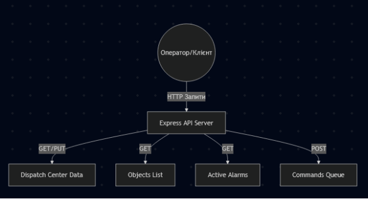

### НАЦІОНАЛЬНИЙ ТЕХНІЧНИЙ УНІВЕРСИТЕТ УКРАЇНИ «КИЇВСЬКИЙ ПОЛІТЕХНІЧНИЙ ІНСТИТУТ ІМЕНІ ІГОРЯ СІКОРСЬКОГО» 
###

# **ОСНОВИ ВЕБ-ПРОГРАМУВАННЯ**
##  Практична робота №4

### **Тема:** **Розробка  REST API для енергетичних даних.**
### **Варіант:** 10 
### **ПІБ студента, група:** Матвієнко Назар Максимович
### **Посилання на Github: https://github.com/64-bite/WEB.git**
### **ПІБ викладача:** Недашківський Олексій Леонідович 
### **Дата виконання:** 16.04.26
###

## Мета роботи
### Навчитися проєктувати та **розробляти** REST API на Node.js + Express для обміну  даними енергетичних об'єктів у форматі JSON.
## 1\. Теоретична частина
### 1\.1. Що таке REST API? 
REST (Representational State Transfer) - архітектурний стиль для створення веб-сервісів,  що використовує HTTP-протокол для обміну даними. 
### 1\.1.1. Основні принципи REST: 
\- Клієнт-серверна архітектура 

\- Відсутність стану (stateless) 

\- Кешування 

\- Єдиний інтерфейс 

\- Шарова система 
### 1\.1.2. HTTP методи в REST API 

|Метод |Призначення |Приклад|
| :- | :- | :- |
|GET |Отримання даних |GET /api/stations - список станцій|
|POST |Створення нового ресурсу |POST /api/stations - створити станцію|
|PUT |Повне оновлення ресурсу |PUT /api/stations/1 - оновити станцію|
|PATCH |Часткове оновлення |PATCH /api/stations/1 - оновити поле|
|DELETE |Видалення ресурсу |DELETE /api/stations/1 - видалити|

### 1\.1.3. Коди відповідей HTTP 
Коди відповідей HTTP 

\- 200 OK - успішний запит

\- 201 Created - ресурс створено 

\- 400 Bad Request - помилка в запиті - 404 Not Found - ресурс не знайдено - 500 Internal Server Error - помилка сервера 
### 1\.1.4. Структура REST API для енергетики 
/api/objects - колекція об'єктів /api/objects/:id - конкретний об'єкт /api/objects/:id/data - дані об'єкта
## 2\. Опис реалізації
### **2.1 Опис варіанту**
**Об’єкт**: REST API для центрів управління енергосистемами з моніторингом балансу  генерації та навантаження, частоти мережі та тривог. 

**Параметри об'єкта:** 

**Параметр Тип Опис** 

id number Ідентифікатор диспетчерського центру name string Назва диспетчерського центру 

monitoredObjects number Кількість об'єктів під контролем 

totalGeneration number Загальна генерація в системі (МВт) 

totalLoad number Загальне навантаження системи (МВт) frequency number Частота в електромережі (Гц) 

systemBalance number Баланс генерації та споживання (МВт) alarmCount number Кількість активних тривог 

operatorCount number Кількість чергових операторів 

**Endpoints API:** 

GET /api/dispatch-center Отримати дані центру 

GET /api/dispatch-center/objects Список всіх підконтрольних об'єктів GET /api/dispatch-center/alarms Отримати активні тривоги 

GET /api/dispatch-center/balance Баланс системи 

POST /api/dispatch-center/commands Відправити команду управління PUT /api/dispatch-center Оновити параметри центру

**Схема взаємодії компонентів:**

**Cтруктури API:**

|**Метод**|**Endpoint**|**Призначення**|**Код успіху**|
| :- | :- | :- | :-: |
|**GET**|**/api/dispatch-center**|**Отримання стану центру**|**200 OK**|
|**GET**|**/api/dispatch-center/objects**|**Список обладнання**|**200 OK**|
|**GET**|**/api/dispatch-center/alarms**|**Активні тривоги**|**200 OK**|
|**GET**|**/api/dispatch-center/balance**|**Баланс системи (Gen/Load)**|**200 OK**|
|**POST**|**/api/dispatch-center/commands**|**Відправка керуючої команди**|**201 Created**|
|**PUT**|**/api/dispatch-center**|**Оновлення параметрів центру**|**200 OK**|

**Документація endpoints:**

1. **GET /api/dispatch-center**
   1. Опис: Повертає повний об'єкт з поточними показниками центру.
   1. Приклад:

      {

      `  `"id": 1,

      `  `"name": "Центральний диспетчерський центр",

      `  `"totalGeneration": 35,

      `  `"frequency": 50,

      `  `"alarmCount": 3

      }

1. **POST /api/dispatch-center/commands**
- Опис: Створює нову команду для обладнання.
- Тіло запиту: {"command": "string", "target": "string", "parameters": {}}
- Можливі помилки: 400 Bad Request (якщо відсутні обов'язкові поля command або target).
- Приклад:

  {

  `  `"id": 1,

  `  `"command": "increase\_generation",

  `  `"status": "pending",

  `  `"timestamp": "2026-04-12T..."

  }

1. **PUT /api/dispatch-center**
   1. Опис: Повне або часткове оновлення даних центру (наприклад, зміна частоти або навантаження).
   1. Код відповіді: 200 OK.

**Коди відповідей для різних ситуацій:**

- 200 OK: Успішне отримання або оновлення даних.
- 201 Created: Успішне створення нової команди.
- 400 Bad Request: Помилка валідації вхідних даних у POST/PUT запитах.
- 404 Not Found: Спроба доступу до неіснуючого ресурсу.
- 500 Internal Server Error: Непередбачена помилка на сервері.
